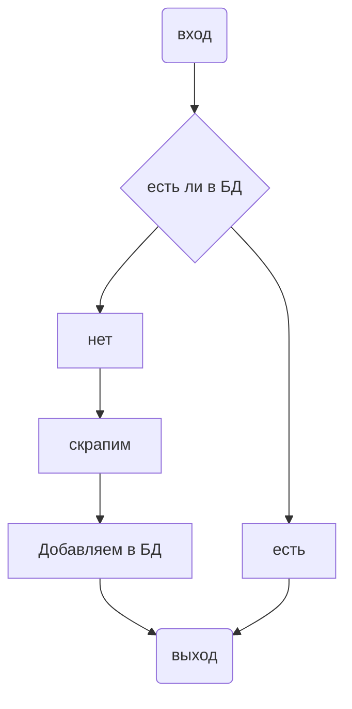

# pyserv

Как взамодействовать
сервис находиться на localhost по порту 8000, pgadmin 5000
-----------
- На главной страничке будет вы указываете цену какого рецепта хоитте узнать.

  > index.html
  > > например, я хочу узнать во сколько мне выйдет готовка борща я пишу в 'борщ' в
  > > верхнию форму и нажимаю submit после чего мы переходим во второй этап
- 2 на этой странце будет список рецептов связанных с тем, что вводилось в начальной странице, а также
  форма для ввода имени рецепта, чью цену хотим узнать
    > choose.html
    > > вот я написал 'Борщ' и теперь у меня есть список из разновидностей борща, к примеру: борщ украинский, борщ с шпинатом
    > >  и так далее.
- 3 на этоп этапе мы полуем эту цену, этого рецепта

# Каждый этап выглядит примерна так
> отсутсвие цены это равенство -1

